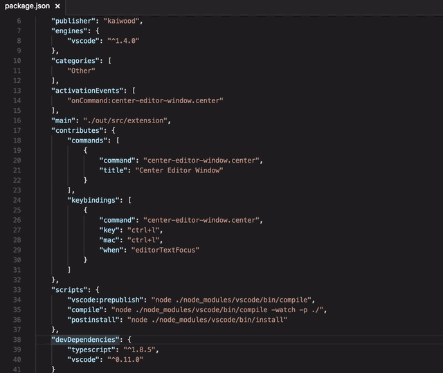

# Center Editor Window

This extension centers your editor window at the current cursor position. Default shortcut is ctrl-l.

## Release Notes

### 2.0.1

Polishing release adding more metadata and images.

Additionaly, some namespaces have changed, so we need to bump the major version because it might break custom set shortcuts.

### 1.0.0

Initial Release