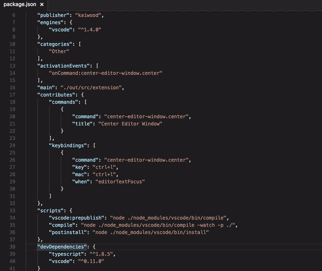

# Center Editor Window

Center the active editor around the current cursor position.

Run `Center Editor Window` from the command palette, or press `Ctrl+L`.

## Settings

- `center-editor-window.threeStateToggle`: toggle between centering the current line, moving it to the top of the viewport, and moving it to the bottom.
- `center-editor-window.offset`: offset from the center target when centering.
- `center-editor-window.typewriterScrollMode`: keep the current line positioned in the viewport whenever the cursor changes lines.
- `center-editor-window.typewriterScrollModePosition`: position the current line at `top`, `center`, or `bottom` when Typewriter Scroll Mode recenters the editor.
- `center-editor-window.typewriterScrollModeSmooth`: only recenter Typewriter Scroll Mode when the current line moves away from the configured viewport position.
- `center-editor-window.centerOnUndoRedo`: keep the current line centered after undo or redo.
